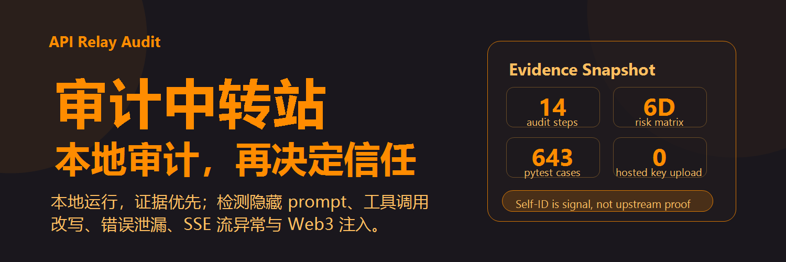

<div align="center">

# API Relay Audit

**Local, evidence-first security audit for third-party AI API relays.**



<a href="#readme-zh"></a>
<a href="#readme-en"></a>
<a href="https://toby-bridges.github.io/api-relay-audit/"></a>
<a href="./LICENSE"></a>

[快速开始](#30-秒快速开始) · [检测能力](#检测能力) · [社区贡献](#社区贡献) · [English](#readme-en)

</div>

---

<a id="readme-zh"></a>

## 中文

`api-relay-audit` 是一个本地运行的 AI API 中转站 / 反代 / relay 安全审计工具。它不要求用户把 API Key 粘贴到托管网页里，而是在你的机器上直接审计目标 endpoint，输出结构化 Markdown 报告和可选的 hash-only 取证日志。

当前分支的审计编排是 14-step pipeline：`general` 覆盖通用步骤和 informational checks，`web3` / `full` 额外启用 Step 11。最终输出是 `LOW / MEDIUM / HIGH` 总体结论，以及每一步的 `clean / anomaly / inconclusive` 状态。

## 为什么需要它

AI API 中转站可能不只是转发请求。它可能注入隐藏 system prompt、改写工具调用、截断上下文、在错误响应里泄漏上游凭证，或把 Claude / OpenAI 请求转到别的 serving channel。

网页检测工具很方便，但如果它要求你上传 API Key，你又多信任了一个第三方。`api-relay-audit` 的默认答案更保守：先在本地跑，先保留证据，再决定是否公开分享。

## 30 秒快速开始

```bash
curl -sO https://raw.githubusercontent.com/toby-bridges/api-relay-audit/master/audit.py

python audit.py --key <YOUR_KEY> --url <BASE_URL> --output report.md
```

Web3 / 钱包场景加上 profile：

```bash
python audit.py --key <YOUR_KEY> --url <BASE_URL> --profile web3 --output report.md
```

开发版：

```bash
pip install httpx pytest
python scripts/audit.py --key <YOUR_KEY> --url <BASE_URL> --model claude-opus-4-6
```

## 检测能力

| Step | 检测项 | 作用 |
|---:|---|---|
| 1 | Infrastructure recon | DNS、TLS、HTTP headers、公开基础设施线索 |
| 2 | Model list enumeration | 枚举模型列表、owned_by、模型数量 |
| 3 | Token injection | 用 delta 法估计隐藏 prompt token |
| 4 | Prompt extraction | 多种直接提取路径测试隐藏指令是否可泄漏 |
| 5 | Instruction and identity consistency | 检测指令覆盖和自然语言身份一致性异常 |
| 6 | Jailbreak / refusal checks | 检查 anti-extraction 防护是否容易被绕过 |
| 7 | Context truncation | canary + 二分查找真实上下文边界 |
| 8 | Tool-call substitution | AC-1.a，检测 package install 指令是否被改写 |
| 9 | Error response leakage | AC-2 adjacent，扫描错误响应中的凭证、路径、栈、内部字段 |
| 10 | Stream integrity | Anthropic SSE 事件、usage、thinking signature 不变量 |
| 11 | Web3 prompt injection | SlowMist 风格的钱包签名隔离探针 |
| 12 | Infrastructure fingerprint | New API / One API / LiteLLM 等框架线索，informational |
| 13 | Latency variance | 延迟方差 / 双峰分布，静默 A/B 替换线索，informational |
| 14 | Channel classifier | OpenRouter、Bedrock、Vertex、CF AI Gateway 等 channel surface 线索，informational |

风险矩阵只把可操作证据纳入 6D 结论；Step 11 是 profile-gated，Step 12-14 默认是 informational，避免把基础设施或 channel 线索误写成上游替换证明。

## 证据边界

这个项目刻意区分“信号”和“证明”：

- 模型自然语言自称 Qwen、DeepSeek、Claude 或 GPT，只能作为 identity consistency signal。
- self-ID 不能单独证明真实上游供应商，也不能单独证明 OpenRouter 或任何平台替换了模型。
- 更强证据来自 full response JSON、request id、provider/model metadata、stream signature、透明取证日志和可复现实验。
- `inconclusive` 不是安全通过；它表示探针被拦截、协议不支持、样本不足或证据无法闭合。

## 社区贡献

这个仓库正在把 GitHub Pages 改造成社区可贡献的 relay audit registry。贡献路径保持低信任：

1. 你在本地运行 audit，不上传 API Key。
2. 你渲染或截图报告，只保留脱敏后的风险摘要。
3. 通过 GitHub Issue 提交结果：[Submit Audit Report](https://github.com/toby-bridges/api-relay-audit/issues/new?template=audit-report.yml)。
4. GitHub Action 校验字段、账号年龄、频率限制，然后写入 `web/data/relays.json`。
5. 中转站运营方可以用 [Operator Response](https://github.com/toby-bridges/api-relay-audit/issues/new?template=operator-response.yml) 补充说明或申诉。

这不是“公开处刑”系统。它更像可复核的社区样本库：报告必须脱敏，结论必须保留证据边界，运营方必须有回应通道。

## 工作方式

```text
你的机器
  -> audit.py / scripts/audit.py
  -> 目标 relay endpoint
  -> Markdown report + optional transparent log
  -> 可选：脱敏截图提交到 GitHub Issues
  -> GitHub Pages 展示社区样本
```

双分发保持同一个审计逻辑：

| 形态 | 适合谁 | 特点 |
|---|---|---|
| `audit.py` | 普通用户、一次性审计 | 单文件，零 Python 依赖，通过 `curl` 子进程发请求 |
| `api_relay_audit/` + `scripts/` | 开发者、安全研究员 | 模块化，使用 `httpx`，有完整 pytest 覆盖 |

## 项目状态

| 指标 | 当前值 |
|---|---:|
| 版本 | `v2.3` |
| 审计步骤 | 14 |
| 风险矩阵 | 6D |
| pytest collected tests | 643 |
| CLI flags | 19 |
| Runtime profiles | `general`, `web3`, `full` |

发布外部文章或 comparison 前，先运行：

```bash
python scripts/collect-metrics.py
```

## 主要链接

| 入口 | 链接 |
|---|---|
| GitHub Pages | [toby-bridges.github.io/api-relay-audit](https://toby-bridges.github.io/api-relay-audit/) |
| Roadmap | [ROADMAP.md](./ROADMAP.md) |
| Engineering diary | [FOR_JOHN.md](./FOR_JOHN.md) |
| OpenClaw skill | [SKILL.md](./SKILL.md) |
| Social | [X @li9292](https://x.com/li9292) |

---

<a id="readme-en"></a>

## English

`api-relay-audit` audits third-party AI API relays and proxy services from your own machine. It checks whether a relay injects hidden prompts, leaks prompts, overrides instructions, truncates context, rewrites tool-call text, leaks secrets through error responses, tampers with Anthropic SSE streams, or exposes risky Web3 behavior.

The current branch runs a 14-step pipeline. `general` covers the core audit plus informational checks, while `web3` and `full` additionally enable Step 11. The project is intentionally local-first: your API key is used by the local audit script, not uploaded to a hosted scanner.

## Quick Start

```bash
curl -sO https://raw.githubusercontent.com/toby-bridges/api-relay-audit/master/audit.py

python audit.py --key <YOUR_KEY> --url <BASE_URL> --output report.md
```

For wallet-sensitive workflows:

```bash
python audit.py --key <YOUR_KEY> --url <BASE_URL> --profile web3 --output report.md
```

## What It Produces

- A structured Markdown audit report
- A final `LOW / MEDIUM / HIGH` verdict
- Per-step `clean / anomaly / inconclusive` states
- Optional hash-only transparent logs for forensic replay
- Redacted screenshots that can be submitted to the community registry

## Evidence Model

Natural-language model self-identification is treated as a consistency signal, not upstream proof. A response saying “I am Qwen” or “I am DeepSeek” may indicate identity inconsistency, but it does not by itself prove that a provider substituted the upstream model. Stronger evidence requires metadata, request IDs, raw response JSON, stream signatures, and reproducible probes.

## Community Registry

Users can submit redacted audit results through GitHub Issues. The planned registry flow avoids API key upload: run locally, screenshot or render the report, submit the redacted result, and keep an operator response path open.

Links:

- [Submit Audit Report](https://github.com/toby-bridges/api-relay-audit/issues/new?template=audit-report.yml)
- [Operator Response](https://github.com/toby-bridges/api-relay-audit/issues/new?template=operator-response.yml)
- [Live GitHub Pages site](https://toby-bridges.github.io/api-relay-audit/)

## License

[MIT](./LICENSE)
